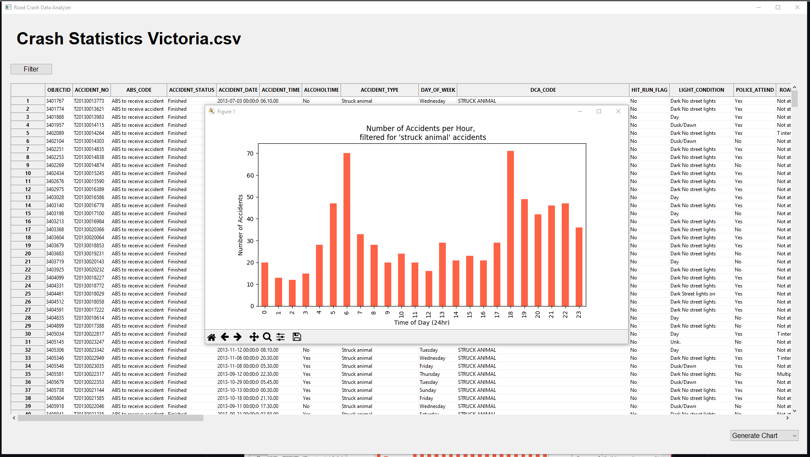

# Road-Crash-Data-Analyzer

I developed this program during my final trimester of university as part of an assignment for a course named 'Software Technologies'. The purpose of the program was to allow the user to analyse/sort a specific .csv file (we could choose from a selection) and generate specific charts for it. This program was designed with the Victoria State Accident Dataset in mind (found here: https://www.kaggle.com/datasets/gaurav896/victoria-state-accident-dataset). 

The pandas library was used to extract, store, and sort the data in the .csv file. Matplotlib was used to generate charts from the data. wxPython was also used to provide a graphical user interface.

There are three charts which can be generated and they are largely pre-defined in terms of which columns they analyze. The user's filter options can modify which rows are selected to generate the chart, i.e., by date range and accident type.

## Screenshots

The initial screen where the user is prompted to select a .csv file for analysis.

The main screen where the imported spreadsheet is displayed with row numbers and column names.

The dialog window that opens when the user clicks on the Filter button. 

Window containing generated pie chart; in this instance, the data was not filtered at all.

Window containing generated bar chart of average accidents by hour of day; in this instance, the data was filtered for accidents containing 'struck animal'.

Window containing generated bar chart of accidents by proportion of alcohol presences; in this instance, the data was filtered for accidents occurring after 01/01/2016.
